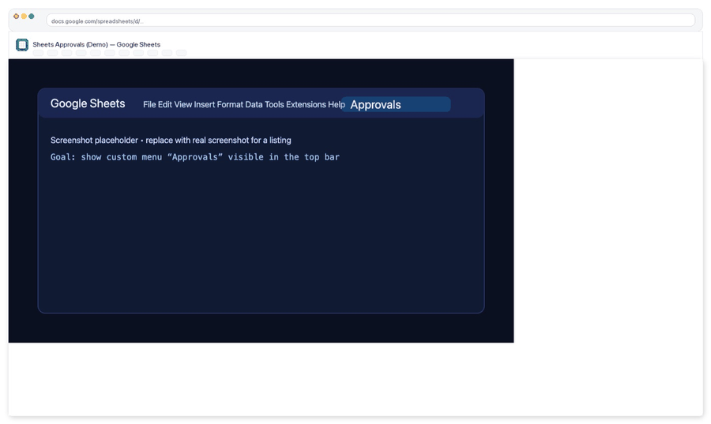

# Screenshots

These images are what the landing page (and a product listing) should reference.

If you haven’t captured real screenshots yet, the repo ships placeholder PNGs with the same filenames.

## Screenshot set

1) Menu (Approvals)

Custom menu entry for Approvals actions (Approve/Reject, Create demo, Help).


2) Requests sheet (pending)

Example request rows in PENDING state, ready for review/approval.


3) Approved row

A request row marked APPROVED (showing status + timestamp/user columns as configured).


4) Audit trail entry

Append-only audit log row capturing who approved/rejected what and when.


5) Re-approval required

An edit to tracked cells triggers REAPPROVAL_REQUIRED (or reverts to PENDING), with an audit event.


6) Help / Docs sidebar

In-sheet Help sidebar for quick onboarding and usage.


## Capturing real screenshots

Follow: [`REAL_SCREENSHOTS_GUIDE.md`](../../REAL_SCREENSHOTS_GUIDE.md)

After capturing, the easiest path is to run the all-in-one pipeline (installs, validates, refreshes STATUS.md, and re-renders the gallery):

```bash
python3 scripts/screenshots_pipeline.py --from ~/Desktop --check --fail-on-placeholders --status --render-gallery
```

If you prefer individual commands:

```bash
python3 scripts/check_screenshots.py
python3 scripts/screenshot_status.py --write
python3 scripts/render_screenshots_gallery.py
```

## Optional: optimized JPGs

If you run the screenshot optimizer, it will generate:

- `docs/screenshots/optimized/*.jpg`

The landing page will automatically prefer these when present (via a `<picture>` tag), falling back to the PNGs.

## Optional: animated preview GIF

Quick animated preview (useful for READMEs / listings):



You can (re)generate it from the optimized JPGs:

```bash
python3 scripts/make_screenshot_gif.py
```

Output:
- `docs/screenshots/approval-flow.gif`

## Packaging a listing-ready ZIP

To generate a single ZIP you can upload to marketplaces:

```bash
python3 scripts/make_screenshot_pack.py
```

Output:
- `dist/screenshot-pack-YYYYMMDD-HHMM.zip`
